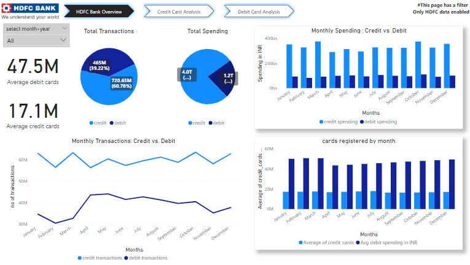
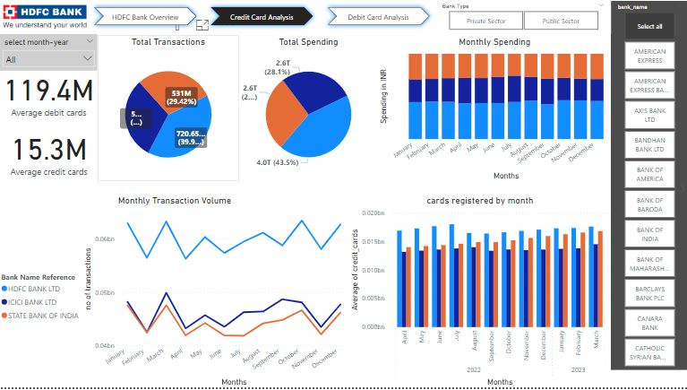
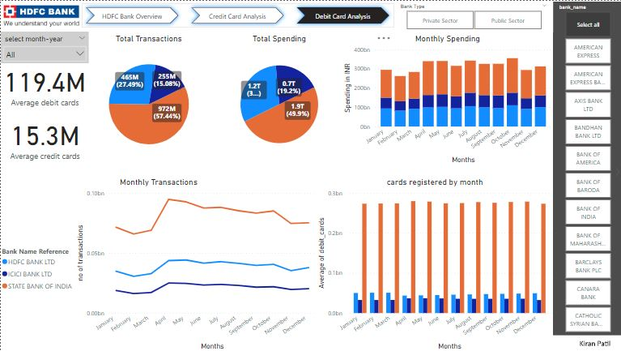

# Indian-Banking-KPI-Analysis

## HDFC Bank Dashboard: Zooming Past the Competition (powered by Web Scraping) 🚀

**HDFC Bank Analysis**

---

**Credit Card Analysis vs Competitors**

---

**Debit Card Analysis vs Competitors**

## What's This About? 🤔

Imagine HDFC Bank is a race car speeding through the busy traffic of Indian banking. I built this custom dashboard – a powerful tool – to help us see how we're doing compared to other banks in this race.

## How I Pulled It Off: 💻

Data scraped from the RBI website covering April 2022 to March 2023 gave me the insights I needed. But it wasn't just raw numbers, I used sophisticated techniques:

- **Selenium WebDriver:** This automated robot interacted with the RBI website, navigating its dynamic pages and clicking through menus to find the right data.

  - Learn more: [Selenium WebDriver Documentation](https://www.selenium.dev/documentation/en/)

- **Requests Library:** Once I had the links to the relevant Excel files, this library downloaded them for me, bringing the data right to my fingertips.
  - Learn more: [Requests Library Documentation](https://docs.python-requests.org/en/latest/)

## Update: Data Cleaning Done! ✨

The scraped raw data has been successfully cleaned and processed. This crucial step ensures data accuracy and consistency for meaningful analysis. Here's what's been accomplished:

- Removal of irrelevant or redundant columns.
- Handling of missing or inconsistent data points.
- Standardization of column names for clarity and consistency.

## Next Steps: 🚧

With the data now in a clean and structured format, the next steps include:

- **Dashboard Development:** Building an interactive and visually compelling dashboard to showcase key insights.
- **Filtering Functionalities:** Enabling users to focus on specific data subsets (cards, banks, months).
- **Data Export Capabilities:** Allowing users to download raw data for further analysis.
- **Testing and Refinement:** Fine-tuning the dashboard for optimal performance and user experience.
- **Deployment for User Access:** Making the dashboard readily available to relevant HDFC Bank teams.

---

Stay tuned for updates! I'm excited to share the complete picture soon.

Feel free to ask questions or cheer me on!

---

## Notebooks :notebook:

- [Web Scraping Notebook](01_web_scraping.ipynb)
- [Monthly Card Data Processing Notebook](02_monthly_card_data_processing.ipynb)

## References :books:

Websites:

- Reserve Bank of India (RBI): [RBI ATM Data](https://www.rbi.org.in/Scripts/ATMView.aspx)

Libraries and Tools:

- Selenium WebDriver: [Selenium WebDriver Documentation](https://www.selenium.dev/documentation/en/)
- Requests Library: [Requests Library Documentation](https://docs.python-requests.org/en/latest/)
